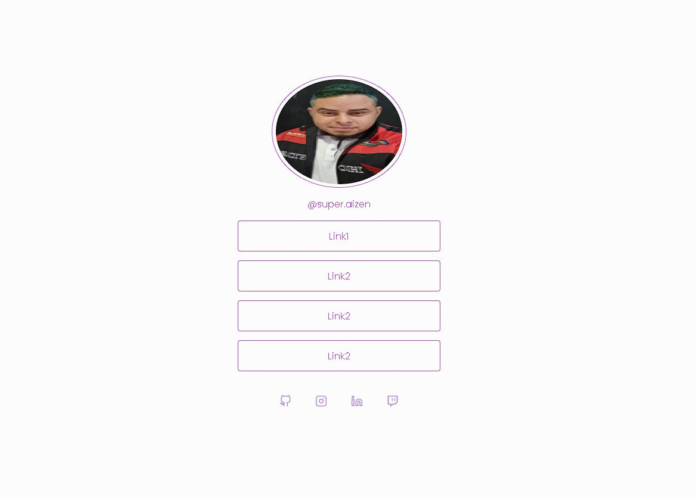

<h1 align="center"> Social Tree</h1>

Página apra divulgar links em geral  

  <a href="#-tecnologias">Tecnologias</a>&nbsp;&nbsp;&nbsp;|&nbsp;&nbsp;&nbsp;
  <a href="#-projeto">Projeto</a>&nbsp;&nbsp;&nbsp;|&nbsp;&nbsp;&nbsp;
  <a href="#-layout">Layout</a>&nbsp;&nbsp;&nbsp;|&nbsp;&nbsp;&nbsp;
  <a href="#memo-licença">Licença</a>

  

 

  

## 🚀 Tecnologias

Esse projeto foi desenvolvido com as seguintes tecnologias:

- HTML
- CSS

## 💻 Projeto

O social tree é eprfeito para vc divulgar suas redes sociais e até mesmo contato pessoal 

- [Visite o projeto online](https://github.com/filipeaizen/social-tree)
## 🔖 Layout

## :memo: Licença

Esse projeto está sob a licença MIT.

---

Feito com ♥ by Filipe Aizen 